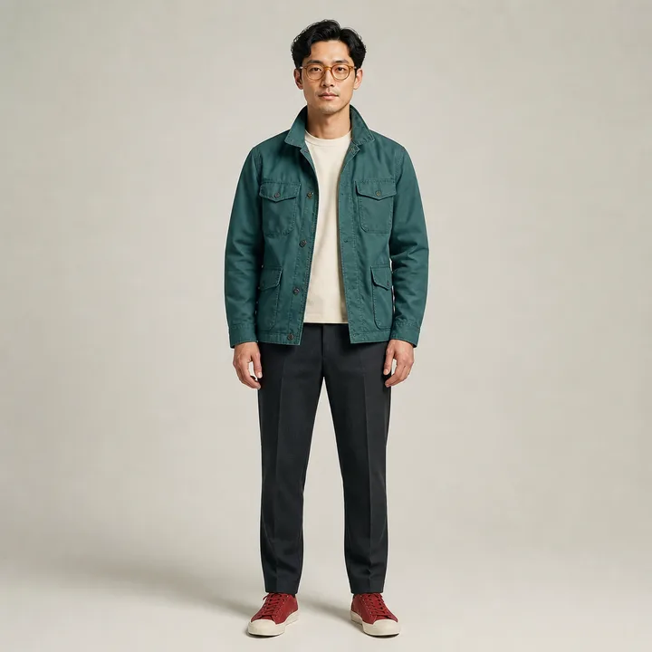
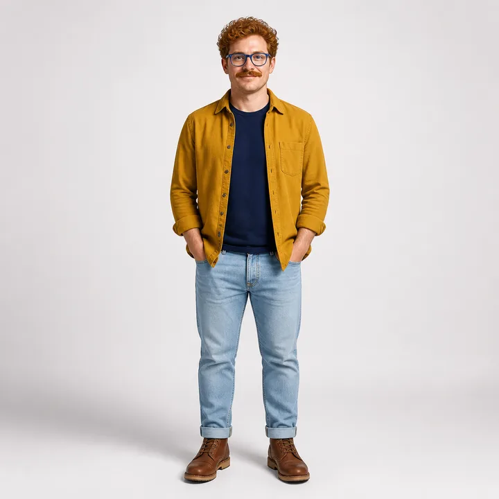
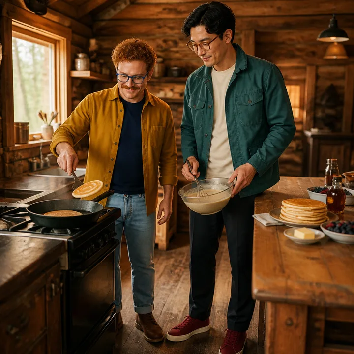
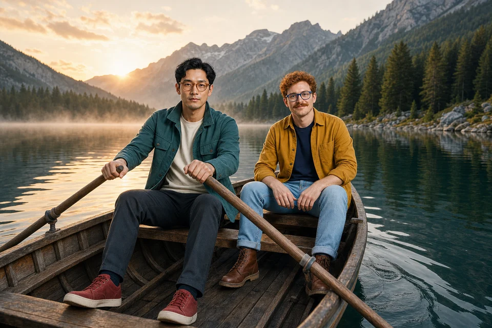

# imgen

An agent-friendly CLI for OpenAI image generation, editing, Responses API image conversations, and reusable character references.

## Install

Requires Node.js 22.18 or newer, [Bun](https://bun.sh), and Git.

```sh
curl -fsSL https://raw.githubusercontent.com/R44VC0RP/imgen/main/install.sh | sh
```

The installer places the application in `~/.local/share/imgen` and links `imgen` into `~/.local/bin`. It does not touch saved credentials, characters, or jobs when reinstalled.

Then save an OpenAI API key using hidden terminal input:

```sh
imgen login
```

`OPENAI_API_KEY` can be used instead and always takes precedence over the saved key.

## Generate and edit

Generate a standalone image with the direct Images API:

```sh
imgen generate \
  "An isolated cobalt ceramic flower, no backdrop" \
  --out flower.png --quality high --background transparent --wait
```

Edit one or more local reference images:

```sh
imgen edit \
  "Change only the petals to sage green" \
  --image flower.png --out flower-green.png --quality high --wait
```

Inputs can include up to 16 PNG, JPEG, or WebP files. Use `--mask mask.png` for guided inpainting.

| Transparent generation | Reference edit |
| --- | --- |
|  |  |

## Responses API image conversations

`respond` uses `gpt-5.6` with the `gpt-image-2` tool by default:

```sh
imgen respond \
  "Create two explorers beside a red seaplane" \
  --out explorers.png --wait --json
```

The JSON result includes a `response_id`. Continue the image conversation with it:

```sh
imgen respond \
  "Keep the same explorers, but move them into a snowy hangar" \
  --previous-response resp_123 \
  --out hangar.png --wait
```

Use `--model` to choose the reasoning model, `--image-model` to choose the image tool model, and `--action auto|generate|edit` to control the image action.

## Recurring characters

Generate or choose a clear reference image for each character, then save it:

```sh
imgen character add alan \
  --image alan.png \
  --description "Tall, wavy black hair, amber glasses, teal jacket"

imgen character add ryan \
  --image ryan.png \
  --description "Curly auburn hair, mustache, blue glasses, mustard overshirt"
```

Mention their handles in any new `respond` request:

```sh
imgen respond \
  "Have @ryan and @alan cook pancakes in a cozy cabin kitchen" \
  --out breakfast.png --wait
```

This is a fresh request—it does not need `--previous-response`. imgen resolves each `@handle`, snapshots its saved references into the job, labels them for the model, and attaches them as high-detail image inputs. Handles are case-insensitive.

```sh
imgen character list
imgen character show alan
imgen character remove alan
```

Multiple clean angles can improve consistency:

```sh
imgen character add alan \
  --image alan-front.png \
  --image alan-side.png \
  --image alan-full-body.png
```

### Character examples

| `@alan` reference | `@ryan` reference |
| --- | --- |
|  |  |

| Fresh request: cooking pancakes | Fresh request: rowing at sunrise |
| --- | --- |
|  |  |

Character references guide identity; generative output will still vary between images.

## Storage and configuration

imgen keeps configuration separate from job state and generated output.

| Data | Default location |
| --- | --- |
| Saved API key | `~/.config/imgen/credentials.json` |
| Character library | `~/.config/imgen/characters/<handle>/` |
| Job records and snapshotted inputs | `~/.local/state/imgen/jobs/` |
| Final images | The path supplied to `--out` |

Credential, character, and job files are created with private permissions. `imgen login` stores the key in `credentials.json` with mode `600`; the CLI never accepts a key as a command-line argument.

Environment overrides:

| Variable | Behavior |
| --- | --- |
| `OPENAI_API_KEY` | Overrides the saved API key |
| `OPENAI_ORG_ID` | Selects an OpenAI organization |
| `OPENAI_PROJECT_ID` | Selects an OpenAI project |
| `XDG_CONFIG_HOME` | Changes the config base directory |
| `XDG_STATE_HOME` | Changes the state base directory |
| `IMGEN_HOME` | Uses one directory for both config and state |

## Background jobs

Generation starts as a detached local job unless `--wait` is supplied:

```sh
imgen generate "A quiet alpine lake" --out lake.png --json
imgen status JOB_ID --watch --json
```

Jobs survive terminal exit but not a reboot or forced worker termination. imgen does not automatically retry failed requests because a disconnected or timed-out request may still incur API charges. Existing output files are never overwritten.

## Useful options

```text
--size WIDTHxHEIGHT|auto
--quality low|medium|high|auto
--background transparent|opaque|auto
--output-format png|webp|jpeg
--output-compression 0..100
--moderation auto|low
--timeout SECONDS
--wait
--json
```

Run `imgen --help` for the complete command reference.

## Develop locally

```sh
git clone https://github.com/R44VC0RP/imgen.git
cd imgen
bun install
bun run typecheck
bun run build
bun link
```

The CLI source is `src/imgen.ts`; the installed executable is built to `dist/imgen.js`.
